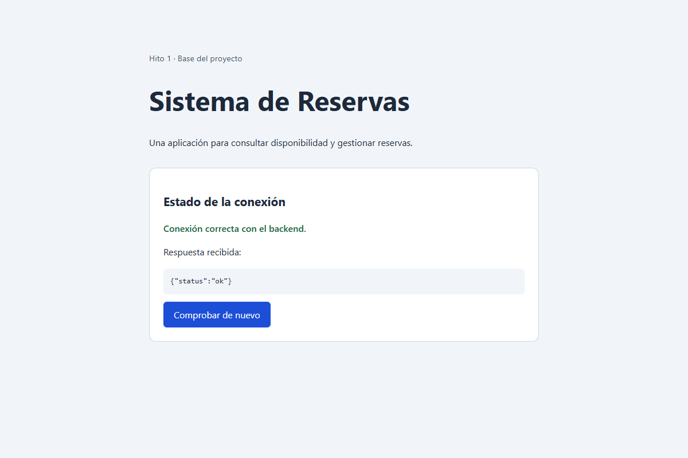
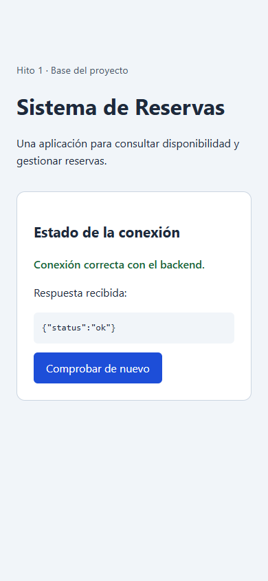

# Hito 1: instalación y configuración

## Alcance

Base del proyecto, sin lógica de negocio: Django, React con Vite y una petición
de prueba entre ambos. La elección inicial se conserva en [hito0.md](hito0.md).
La guía para reproducir el arranque desde cero está en el [README](../README.md).

## Pasos realizados

1. Se creó el entorno virtual `.venv` con Python 3.11.9 y se instaló Django 5.2.18.
2. Se añadió `python-dotenv` para leer `.env` desde la raíz del proyecto.
3. Se preparó `.env.example` sin claves reales y un script para generar la clave
   de Django en el archivo local `.env` sin imprimirla.
4. Se dejó pendiente la integración de Supabase/PostgreSQL. El endpoint de prueba
   no necesita una base de datos, migraciones ni seeders.
5. Se mantuvo `/` con «hola mundo» y se añadió `/api/health/` con `JsonResponse`.
6. Se creó el frontend React con Vite y una pantalla que consulta ese endpoint.
7. Se configuró el proxy `/api` de Vite para comunicar los puertos 5173 y 8000.
8. Se añadieron las exclusiones de Git y los archivos para reproducir la instalación.

## Pruebas de funcionamiento

Las capturas muestran únicamente las páginas de prueba; no muestran `.env`,
credenciales ni directorios de dependencias.

### Backend

La ruta http://127.0.0.1:8000/api/health/ responde con JSON y código HTTP 200.

### Frontend y comunicación

La pantalla React muestra «Conexión correcta con el backend» después de recibir
el JSON de Django a través del proxy. El botón permite repetir la petición.

También se comprobó la pantalla en un ancho de móvil de 390 píxeles.

La comprobación automática adicional y las versiones realmente utilizadas se
recogen en [validacion.md](validacion.md).

## Problemas encontrados y soluciones

| Problema | Solución |
| --- | --- |
| `ERR_CONNECTION_REFUSED` al abrir el backend | Arrancar Django y mantener abierta su terminal. |
| Node.js y npm no estaban disponibles en esta sesión | Se usó Node.js portátil oficial para validar. Para repetir el arranque, instalar Node.js 24 LTS y abrir una terminal nueva. |
| PowerShell puede bloquear scripts de activación | Usar directamente `.venv\Scripts\python.exe` y `npm.cmd`. |
| El frontend y el backend usan puertos distintos | El proxy de Vite reenvía `/api` a Django. |
| Falta la clave de Django | Ejecutar `python backend/configure_env.py`. El backend muestra un mensaje sin revelar claves. |
| Puerto 5173 ocupado | Detener el servidor anterior; Vite no cambia de puerto silenciosamente. |
| El endpoint nuevo devolvía 404 | Reiniciar el servidor anterior, que había arrancado con `--noreload` y conservaba las rutas antiguas. |
| `Python==3.11.9` figuraba como paquete en requisitos | Dejar la versión de Python como comentario; el intérprete se instala por separado. |
| `npm ci` fallaba con `EPERM` en Windows | Detener Vite antes de reinstalar: su proceso mantenía una biblioteca nativa abierta. |

Si cambias `.env`, reinicia los servidores para cargar los nuevos valores.
Supabase/PostgreSQL queda pendiente de integración en un hito posterior.

## Git y entrega

No se incluyen los directorios de dependencias, los secretos ni archivos de datos locales.
Los archivos de requisitos y el bloqueo de npm permiten reinstalar el entorno.
La comprobación local no sustituye la revisión cruzada con otro equipo.
La publicación en GitHub y las contribuciones personales deben corresponder
a trabajo real, sin atribuciones inventadas.
